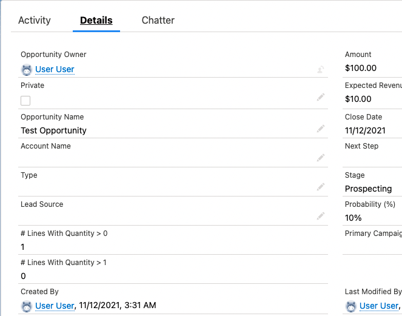
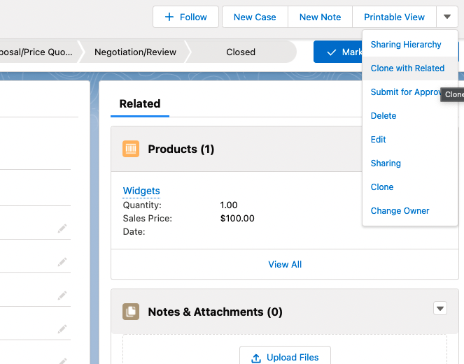
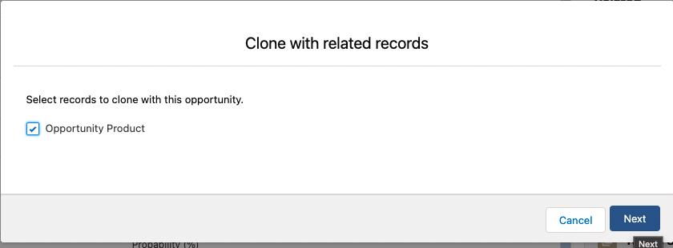
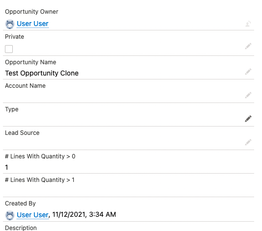

# Opportunity "Clone With Related" Roll-Up Issue

This repo demonstrates a potential bug with roll-up summaries when an Opportunity is cloned with its related Opportunity
Products. The problem seems to be specific to roll-up summaries using a condition to count Opportunity Products. 
If the count in the roll-up is 0, and then the Opportunity is cloned with related products, then the clone Opportunity 
has a `null` in the roll-up field instead of `0`. 

## Setup

1. Use the associated config file [roll-up-opp-products-scratch-def.json](config/roll-up-opp-products-scratch-def.json) 
file to get the name used by later commands
2. Push the source `sfdx force:source:push -u roll-up-opp-products`
3. Execute Apex to create an Opportunity `sfdx force:apex:execute --apexcodefile scripts/create_opportunity.apex -u roll-up-opp-products`
4. Open the org `sfdx force:org:open -u roll-up-opp-products`

## Reproduce

1. Find the Opportunity called "Test Opportunity"
2. Observe that it has values `1` and `0` in the roll-up fields "# Lines With Quantity > 0" and "# Lines With Quantity > 1"  

3. Clone the Opportunity with related products


4. Observe that the cloned Opportunity has `1` and `null` in the roll-up fields
   
5. Note that this is not a UI bug (i.e. not [https://trailblazer.salesforce.com/issues_view?id=a1p3A000000IYvUQAW&title=lightning-rollup-summary-fields-are-not-updated-when-child-record-is-deleted](https://trailblazer.salesforce.com/issues_view?id=a1p3A000000IYvUQAW&title=lightning-rollup-summary-fields-are-not-updated-when-child-record-is-deleted))
Test that by doing a query 
```
sfdx force:data:soql:query -q "SELECT Id, Name, Lines_With_Quantity_gt_0__c, Lines_With_Quantity_gt_1__c FROM Opportunity" -u roll-up-opp-products
 
ID                  NAME                    LINES_WITH_QUANTITY_GT_0__C  LINES_WITH_QUANTITY_GT_1__C
──────────────────  ──────────────────────  ───────────────────────────  ───────────────────────────
0062D00000G3riYQAR  Test Opportunity        1                            0
0062D00000G3rkKQAR  Test Opportunity Clone  1                            null
Total number of records retrieved: 2.
Querying Data... done
```